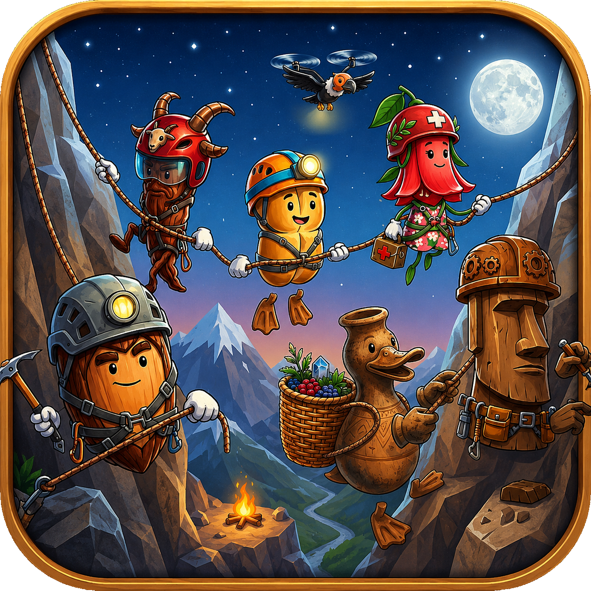
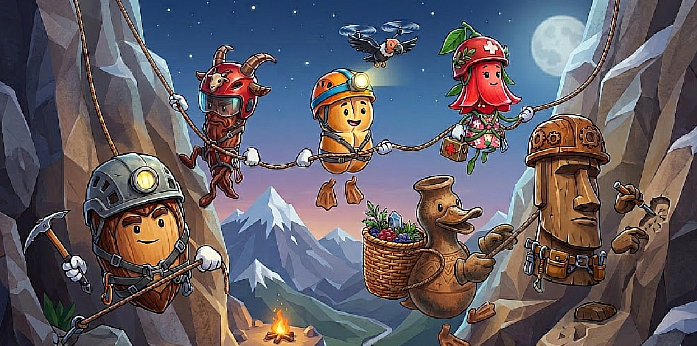
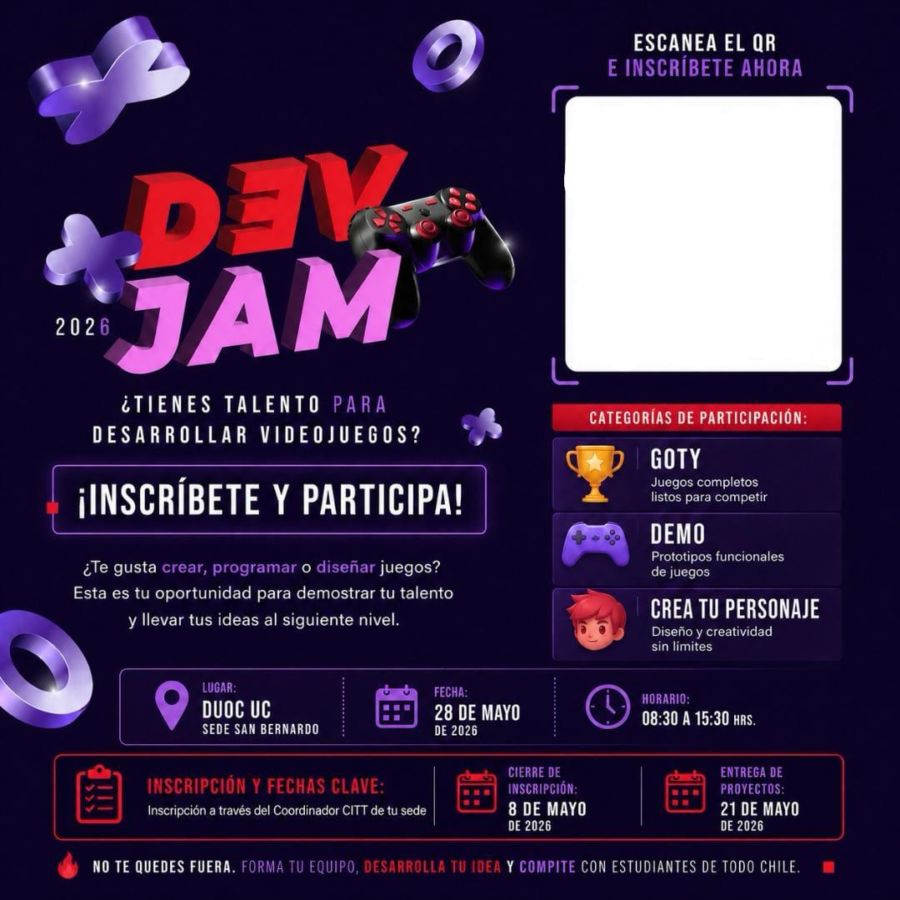

<div align="center">



# Climb Together

[](https://godotengine.org/)
[](https://www.instagram.com/p/DYFWJDXo1N6/)

¡Escala en esta aventura multijugador hasta alcanzar la cima!

<!-- <a href="." rel="noopener">
  
</a> -->

</div>

---

## Climb Together <a name = "about"></a> 

Aventura de escalada multijugador en 3D donde debes trabajar en equipo para alcanzar la cima.

## 🎮 Acerca del Juego

Climb Together es un juego en 3D que combina elementos de juego cooperativo con mecánicas basadas en física. Inspirado en títulos como *Bread & Fred*, *Peak* y *Chained Together*, el juego desafía a los jugadores a trabajar juntos, utilizando creatividad con el momentum, sincronización y timing para superar obstáculos y escalar a alturas cada vez mayores.

<div align="center">
    
</div>

Ya sea que juegues solo o con un amigo, cada ascenso pone a prueba tus habilidades para resolver problemas y tus reflejos mientras navegas por un terreno montañoso traicionero, interactúas con entornos dinámicos y descubres secretos ocultos en el camino.

---

## ✨ Características

- **Juego Cooperativo** – Juega solo o únete con un amigo para una experiencia completamente diferente
- **Mecánicas Basadas en Física** – Aprovecha el momentum, la gravedad y física
- **Desafíos de Plataformas en 3D** – Navega por un diseño de nivel intrincado con múltiples rutas y atajos ocultos
- **Entornos Dinámicos** – Objetos interactivos, plataformas móviles y peligros te mantienen alerta
- **Dificultad Progresiva** – Domina lo básico y avanza a través de desafíos cada vez más complejos
- **Diseño de Niveles Gratificante** – Descubre múltiples soluciones a los obstáculos y encuentra tu propio camino hacia la cima

---

## 🎮 Cómo Jugar

### Controles

**Jugador 1:**
- **WASD** – Movimiento
- **Espacio** – Saltar
- **Ratón** – Mirar alrededor
- **E** – Interactuar

### Mecánicas de Juego

1. **Escalada** – Salta e interactúa con superficies para escalar hacia arriba
2. **Momentum** – Construye velocidad para superar brechas y alcanzar plataformas más altas
3. **Cooperación** – Algunos acertijos requieren movimiento sincronizado o asistencia del compañero
4. **Resolución de Problemas** – Experimenta con el entorno para encontrar el enfoque correcto
5. **Exploración** – Busca rutas alternativas y objetos coleccionables

---

## 🏁 Participación en la _DevJam_ San Bernardo

El juego participa _DevJam_ organizada por el CITT de San Bernardo, en la categoría GOTY (Juego del Año).

<div align="center">
    
</div>

## Pitch

### CLIMB TOGETHER

"Una aventura donde la verdadera altura se mide en equipo"

¿Qué tal si mezclas el folclore chileno con la tensión de sobrevivir y para rematar, una marraqueta?

Eso es Climb Together: un juego cooperativo de escalada en 3D donde el equipo lo es absolutamente todo. A cargo de un pan batido con alma de héroe, un grupo de rescatistas tiene que enfrentarse a una montaña de miedo dividida en cinco biomas implacables para salvar a tres escaladores perdidos. Pero ojo: la cumbre no solo guarda frío, también esconde un secreto que puede destrozar hasta la amistad más sólida.

##### Pilares del juego

1. Cooperación con roles únicos

Aquí nadie escala solo. Para salir adelante hay que combinar las habilidades de un equipo experto (y bien chileno):

- La Marraqueta (Líder/Protagonista): Es el pegamento del equipo. Mantiene la cohesión y la moral alta cuando todo se pone difícil.
- El Explorador: Manda a su cóndor de confianza para cambiar la perspectiva, revelando rutas ocultas, grietas peligrosas y el mejor camino.
- El Ancla: El coloso del grupo. Tiene la fuerza bruta para sostener el peso de varios compañeros colgando al vacío en los momentos críticos.
- El Ingeniero: El cerebro táctico. Fabrica herramientas esenciales sobre la marcha estacas, cuerdas reforzadas, poleas para superar obstáculos que parecen imposibles.
- El Curandero y el Recolector: Imprescindibles para mantener la stamina, curar la hipotermia y conseguir recursos en plena pared de roca.

2. La naturaleza como enemigo (5 biomas)

La montaña es casi un personaje más. Los jugadores enfrentan cinco zonas distintas, cada una con sus propias reglas de supervivencia: desde bosques cordilleranos con vientos traicioneros que te desestabilizan el agarre, hasta cumbres heladas extremas, es una carrera contra el reloj.

3. Una historia con sabor y misterio

Lo que empieza como una misión de rescate noble se convierte en thriller psicológico y aventura. Al llegar arriba, los rescatistas descubren un tesoro oculto. Y ese hallazgo pone a prueba la lealtad del grupo, revelando las verdaderas (y oscuras) razones detrás de la desaparición de los escaladores. ¿Ganará la codicia o la amistad?

¿Por qué va a funcionar?

Fiebre cooperativa: Juegos como It Takes Two o Overcooked demuestran que la gente adora títulos donde la coordinación es clave. Climb Together lleva esa tensión a la escalada vertical.

Identidad y meme-marketing: El diseño de personajes una marraqueta, fauna chilena genera un atractivo visual inmediato, muy fácil de compartir en redes como TikTok o Twitch.

Rejugabilidad: Con cinco biomas, gestión de recursos, crafteo y distintas combinaciones de roles, cada ascenso se siente distinto.
La montaña no perdona, el viento corta como navaja, pero el pan de cada día... es salvar vidas. ¿Tienes lo que se necesita para mantener al equipo unido, o el tesoro de la cumbre los separará para siempre? Asegura tu arnés. Esto es Climb Together.

> [!NOTE]
> Pitch descargable en formato PDF: [Pitch_Climb_Together.pdf](docs\pdf\Pitch_Climb_Together.pdf)


## 🚀 Instalación y Configuración

### Requisitos

- **Godot 4.0+** (para ejecutar desde la fuente)
- **Windows, macOS o Linux**
- Mínimo 4GB de RAM
- GPU compatible con OpenGL 4.3+

### Inicio Rápido

#### Opción 1: Ejecutar la Compilación Exportada
1. Descarga la última versión desde la página de [Lanzamientos](./releases)
2. Extrae el archivo
3. Ejecuta el ejecutable para tu plataforma
4. ¡Disfruta!

#### Opción 2: Ejecutar desde el Código Fuente
1. Clona este repositorio:
   ```bash
   git clone https://github.com/Marfullsen/devjam_sb_2026.git
   cd devjam_sb_2026
   ```
2. Abre el proyecto en Godot 4:
   - Lanza Godot 4
   - Selecciona "Importar" y navega a la carpeta del proyecto
   - Abre `project.godot`
3. Presiona **F5** para ejecutar el juego

---

## 📁 Estructura del Proyecto

```
devjam_sb_2026/
├── scenes/              # Escenas y niveles del juego
│   ├── levels/         # Escenas de niveles individuales
│   ├── characters/     # Escenas de personajes jugadores
│   └── ui/            # Escenas y menús de interfaz
├── scripts/            # Código GDScript
│   ├── players/       # Control y física del jugador
│   ├── mechanics/     # Mecánicas de juego e interacciones
│   └── managers/      # Gerenciadores de juego y singletons
├── assets/            # Activos de arte y audio
│   ├── models/       # Modelos 3D
│   ├── textures/     # Texturas y materiales
│   └── sounds/       # Archivos de audio
├── resources/        # Recursos de Godot (materiales, partículas, etc.)
└── project.godot     # Configuración del proyecto
```

---

## 🛠️ Desarrollo

### Construido con

- **Motor:** Godot 4.0+
- **Lenguaje:** GDScript
- **Gráficos:** OpenGL 4.3+
- **Física:** Godot Physics 3D

### Dependencias Clave

- Motor de física de Godot 4 integrado
- No se requieren complementos externos

### Contribuir al proyecto

¡Gracias por contribuirnos! Para aportarnos:

1. Haz fork del repositorio
2. Crea una rama del cambio (`git checkout -b feature/CaracterísticaIncreíble`)
3. Confirma tus cambios (`git commit -m 'Añade CaracterísticaIncreíble'`)
4. Haz el push a la rama (`git push origin feature/CaracterísticaIncreíble`)
5. Abre un Pull Request

---

## 🎯 Inspiración del Diseño del Juego

Climb Together se inspira en:

- **Bread & Fred** – Plataformas cooperativas basadas en física
- **Peak** – Mecánicas de escalada y diseño de niveles desafiantes
- **Chained Together** – Resolución de acertijos cooperativos y progresión vertical

Este juego combina los mejores elementos de cada uno para crear una experiencia única que celebra el trabajo en equipo y la resolución creativa de problemas.

---

## 📝 Progresión de Niveles

El juego presenta múltiples niveles de dificultad creciente:

1. **Zona de Tutorial** – Aprende lo básico del movimiento y el salto
2. **Estribaciones** – Introducción suave a las mecánicas cooperativas
3. **Pendiente Media** – Emergen los acertijos basados en física
4. **Cresta Alpina** – Navegación y timing desafiantes
5. **La Cumbre** – Pruebas finales de habilidad y trabajo en equipo

Tiempo de juego estimado: **1-2 horas**

---

## 🐛 Problemas Conocidos y Limitaciones

- Soporte para controles en camino para una actualización futura
- Algunos casos especiales con interacciones de física en pendientes pronunciadas
- Optimización de rendimiento pendiente para GPU de gama baja

Consulta la página de [Problemas](./issues) para más detalles y reportar errores.

---

## 🙌 Créditos

### Equipo de Desarrollo <a name = "authors"></a>
- **Líder del equipo, Pitch final:** [Marfullsen](https://github.com/Marfullsen)
- **Diseño y Programación:** [Marfullsen](https://github.com/Marfullsen), [Nairod](https://github.com/0unknown0user), [Felipe](https://github.com/Felipevillanueva)
- **Arte y Audio:** [Nairod](https://github.com/0unknown0user)
- **Pruebas y Retroalimentación:** [Felipe](https://github.com/Felipevillanueva)

### Agradecimientos Especiales
- La comunidad de Godot por herramientas increíbles y soporte
- Desarrolladores de videojuegos indie que siempre nos inspiran a hacer videojuegos
- Agradecimientos al instituto por organizar el evento cada año.

<div align="center">
    
</div>

---

## 📞 Contacto y Soporte

- **Reportar Problemas:** [Problemas de GitHub](./issues)
- **Discord:** PRONTO!
- **Correo Electrónico:** marfullsen@gmail.com

---

## 🔗 Enlaces

- [Motor Godot](https://godotengine.org/)
- [Afiche de la DevJam en Instagram](https://www.instagram.com/p/DYFWJDXo1N6/) – Evento organizado por el instituto.
- Bases del concurso DevJam: [2026_CITT.pdf](./docs/pdf/DevJam%202026_CITT.pdf)
- Página en itch.io: PRONTO!

---

**¡Gracias por jugar Climb Together! ¡Alcanza la cumbre!** 🏔️